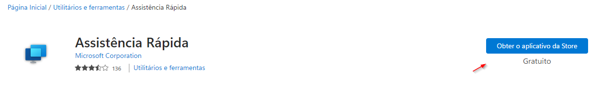

# Assistência Rápida

A Assistência Rápida é um aplicativo da Microsoft Store que permite que uma pessoa compartilhe seu dispositivo com outra por meio de uma conexão remota. A equipe de suporte pode usá-lo para se conectar remotamente ao dispositivo de um usuário e, em seguida, podem solucionar problemas, diagnosticar problemas tecnológicos e fornecer instruções aos usuários diretamente em seus dispositivos.

## Acessando o aplicativo

1. Digite Assistência Rápida na pesquisa do Windows e pressione ENTER.

2. Com o aplicativo aberto -> insira o código que o tecnico informar -> Enviar. 

## Instalar Assistência Rápida

1. Baixe o Assistência Rápida visitando a [Microsoft Store](https://apps.microsoft.com/store/detail/assist%C3%AAncia-r%C3%A1pida/9P7BP5VNWKX5). 
2. Na Microsoft Store, selecione Entrar no aplicativo Store. Em seguida, dê permissão para instalar Assistência Rápida. Quando a instalação estiver concluída, clique em Abrir.

